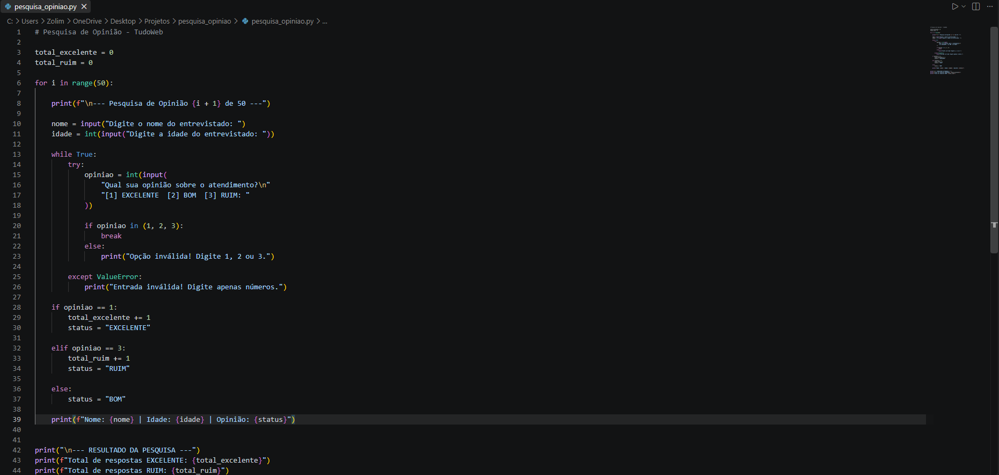
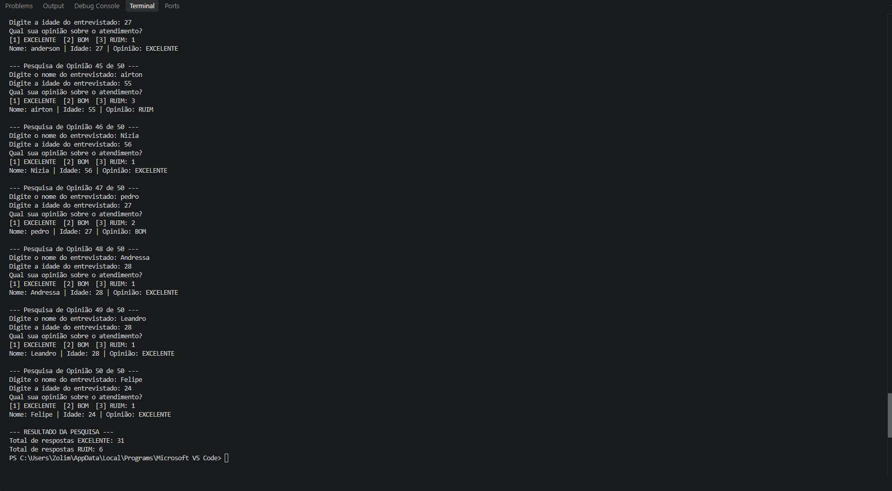

# 📊 Pesquisa de Opinião - TudoWeb

Projeto desenvolvido em **Python** para realizar uma pesquisa de satisfação com clientes da empresa fictícia **TudoWeb**.

## 🎯 Objetivo

O programa tem como objetivo coletar informações dos entrevistados e verificar o grau de satisfação com o atendimento prestado.

Durante a pesquisa são solicitados:

* 👤 Nome do entrevistado
* 🎂 Idade do entrevistado
* 💬 Opinião sobre o atendimento

As opções de opinião são:

**1 - EXCELENTE**
**2 - BOM**
**3 - RUIM**

## 💻 Funcionamento

O programa utiliza uma estrutura de repetição `for` para realizar a pesquisa com **50 entrevistados**.

Também são utilizadas estruturas de decisão `if`, `elif` e `else` para verificar a opinião informada pelo entrevistado.

Ao final da pesquisa, o programa apresenta:

* ✅ Quantidade de respostas **EXCELENTE**
* ❌ Quantidade de respostas **RUIM**

## 🔄 Estruturas utilizadas

Durante o desenvolvimento foram utilizados:

* 🔁 `for` — repetição da pesquisa
* 🔄 `while` — validação da opinião
* 🔀 `if / elif / else` — identificação da resposta
* ⌨️ `input()` — entrada das informações
* 🔢 `int()` — conversão dos valores numéricos
* 📈 Contadores — quantidade de respostas

## 🧪 Teste do programa

Para verificar o funcionamento do programa, foi realizado um teste com **10 entrevistados**.

Durante o teste foram cadastrados nomes, idades e opiniões diferentes para verificar se os contadores estavam funcionando corretamente.

Exemplo de resultado:

```text
--- RESULTADO DA PESQUISA ---
Total de respostas EXCELENTE: 6
Total de respostas RUIM: 2
```

Após a realização dos testes, o programa foi configurado novamente para realizar a pesquisa com **50 entrevistados**, conforme solicitado na atividade.

## 📁 Arquivos do projeto

```text
📦 pesquisa-opiniao-tudoweb
 ┣ 📄 pesquisa_opiniao.py
 ┣ 📄 README.md
 ┗ 📂 prints
    ┣ 🖼️ codigo.png
    ┣ 🖼️ execucao.png
    ┗ 🖼️ resultado.png
```

## 🛠️ Tecnologias utilizadas

* 🐍 Python
* 💻 Visual Studio Code
* 🌐 GitHub

## 📸 Prints da atividade

### Código



### Resultado



## 📚 Competências desenvolvidas

* Implementação de algoritmos de programação.
* Utilização de estruturas de repetição.
* Utilização de estruturas de decisão.
* Desenvolvimento de raciocínio lógico.
* Codificação de programas em Python.

---

👨‍💻 **Projeto desenvolvido para a atividade de Desenvolvimento de Sistemas.**
